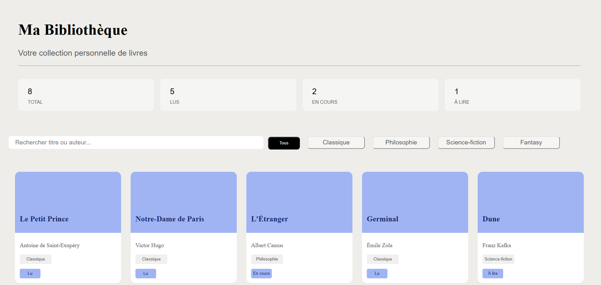

# 📚 Ma Bibliothèque

Une application web simple pour gérer une collection personnelle de livres.

---

## ✨ Fonctionnalités

### 📊 Statistiques des livres
- Total
- Lus
- En cours
- À lire

### 🔎 Recherche
- Recherche par titre ou auteur

### 🏷️ Filtres par catégorie
- Classique
- Philosophie
- Science-fiction
- Fantasy

### 📖 Cartes de livres
Chaque livre affiche :
- Titre
- Auteur
- Catégorie
- Statut de lecture

---

## 🖼️ Aperçu



---

## 🛠️ Technologies utilisées

- HTML5
- CSS3 (Grid + Responsive Design)
- JavaScript

---

## 📱 Responsive Design

L’application est entièrement responsive et adaptée à :
- 📱 Mobile
- 📲 Tablette
- 💻 Ordinateur

---

## 📁 Structure du projet

```
Projet_Cards/
│
├── index.html
├── css/
│   └── style.css
├── js/
│   └── test.js
└── assets/
    └── preview.png
```

---

## 🚀 Lancer le projet

1. Cloner le dépôt :

```bash
git clone https://github.com/wall966/Projet_Cards.git
```

2. Accéder au dossier :

```bash
cd Projet_Cards
```

3. Ouvrir le fichier `index.html` dans un navigateur

---

## 💡 Améliorations possibles

* Ajouter un backend (Node.js ou Python)
* Sauvegarde des données (localStorage ou base de données)
* Ajouter/supprimer des livres
* Système d’authentification utilisateur

---

## 👤 Auteur

Projet développé par **Wallace**

---

